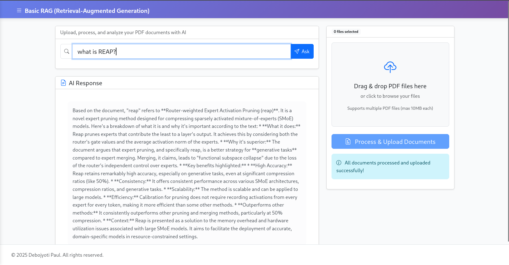

# BasicAngularNestJSRAG

A full-stack RAG (Retrieval Augmented Generation) application built with Angular and NestJS, utilizing node-llama-cpp for local LLM inference.

## Project Structure

This project follows a monorepo structure using Nx:

```
.
├── apps/
│   ├── backend/        # NestJS backend application
│   └── frontend/       # Angular frontend application
├── libs/
│   └── sharedDTO/      # Shared DTOs and interfaces
├── package.json
└── nx.json
```

## Features

- **Frontend**: Angular application with responsive design
- **Backend**: NestJS server with REST APIs
- **RAG Integration**: 
  - Embeddings: Using langchain.js and Google's Gemini API(gemini-embedding-001)
  - LLM Generation: Using langchain.js and Google's Gemini API(gemini-2.5-flash-lite)  
  - Reranking: Using node-llama-cpp for local inference([giladgd/Qwen3-Reranker-0.6B-GGUF])
- **Document Management**: CRUD operations for documents
- **Vector Database**: PostgreSQL with pgvector extension for document embeddings and retrieval
- **Search Functionality**: RAG-based search and content generation

# Re-ranker Configuration
This is the only offline model we are using.
Download Qwen3-Reranker-0.6B.Q4_K_M.gguf from https://huggingface.co/giladgd/Qwen3-Reranker-0.6B-GGUF and place it in backend/assets/modelzoo

## Environment Variables

The application uses environment variables for configuration. Create a `.env` file in the backend directory with the following variables:
- GEMINI_API_KEY=your_gemini_api_key_here

To run the application run the following commands sequentially:
npm install
npx nx serve frontend
npx nx serve backend



## Acknowledgments

- [Angular](https://angular.io/)
- [NestJS](https://nestjs.com/)
- [node-llama-cpp](https://github.com/ggerganov/node-llama-cpp)(llama.cpp node bindings)
- [llama.cpp](https://github.com/ggml-org/llama.cpp)
- [langchain](https://docs.langchain.com/oss/javascript/langchain/overview)
